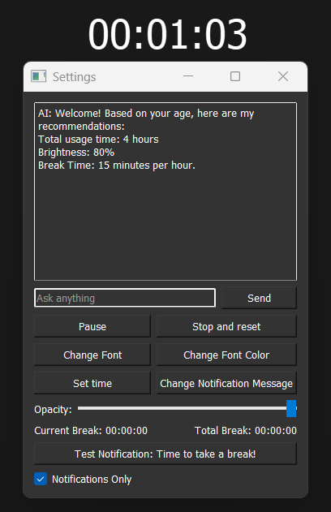

# MomApp - Screen Time Manager

## Features
- Real-time usage tracking
- Break reminders
- Cross-platform support

## Installation
```bash
pip install -r requirements.txt
python -m src.main

```
## Issues
- OpenAI support no longer working. Subscription expired.
- Most future features would be working, but non-fuctional. Mostly for practice purposes.

## Future Features
- Database using sqlite, sqlalch : For storing user sessions, break history, user data, sessions and etc.
- Login and auth with flask : For personalization and data persistence
  - BCrypt (Password Hasing)
- Cross-platform services using Firebase : Device variation
  - Mobile
  - Websockets
  - RESTAPI
- Payment : For premium features
  - Stripe
  - Paypal
- Data Analytics : Visualization of user patterns
  - Matplotlib/Seaborn
  - Plotly Dash
